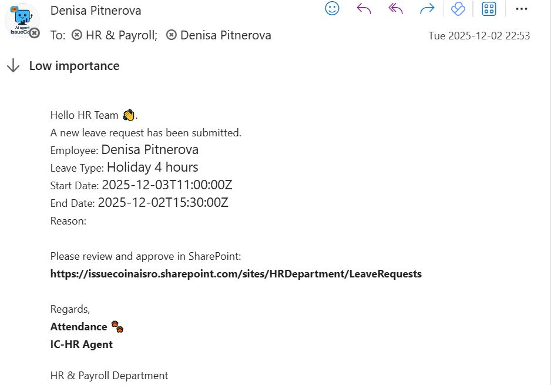
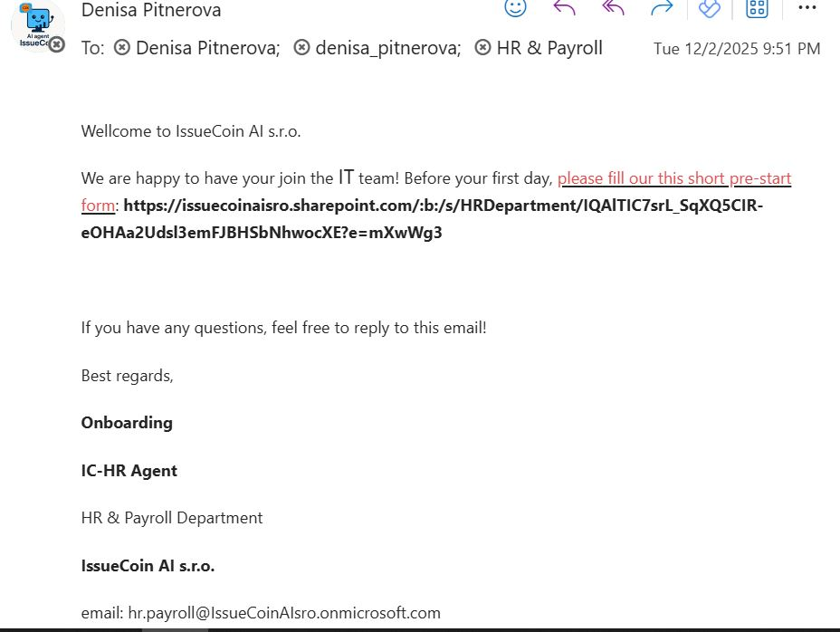
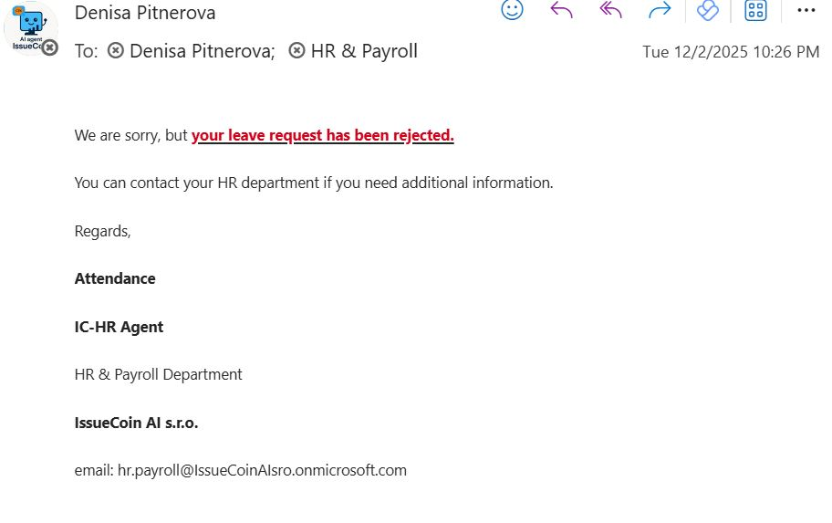
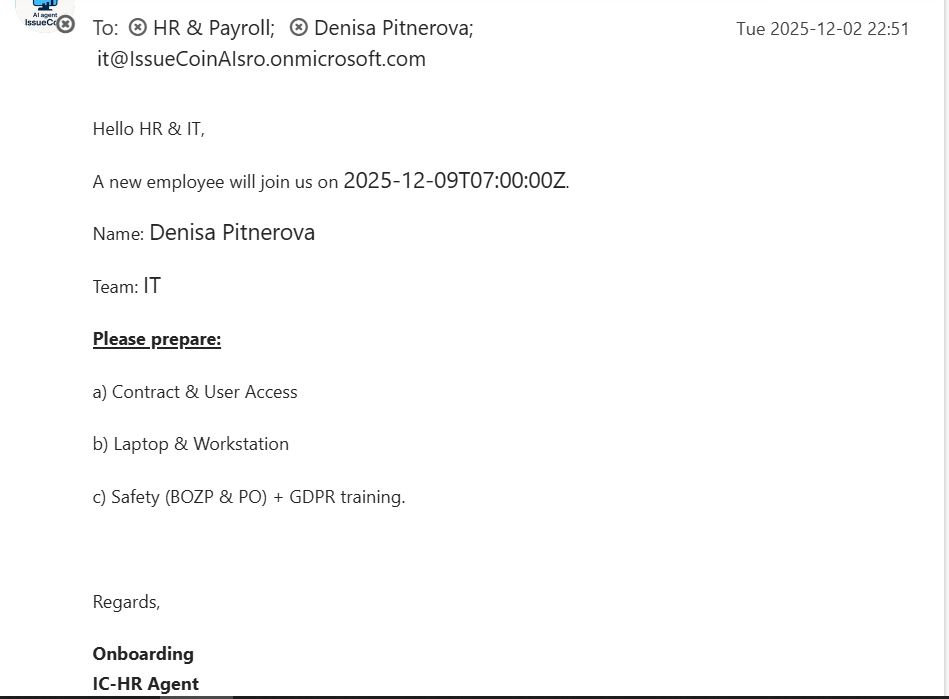
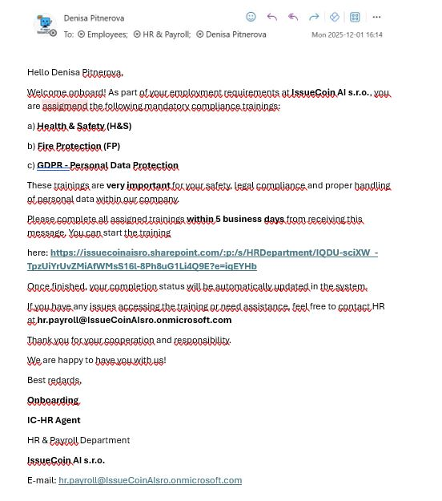

## 🚀 IssueCoin AI — HR Automation System

AI-driven **HR & Payroll multi-agent automation** for **IssueCoin AI s.r.o.**, built on **Microsoft 365** and **Azure OpenAI**.
System automates **onboarding, attendance approvals, mandatory training** and internal email communication using enterprise workflow automation.

## 🤖 Multi-Agent Architecture

| Agent                          | Responsibility                                          | Technology                    |
| ------------------------------ | ------------------------------------------------------- | ----------------------------- |
| **IssueCoin AI (Chief Agent)** | Controls all HR sub-agents, communication & decisions   | Azure OpenAI                  |
| **IC-HR Agent**                | HR workflows orchestration, email actions               | Power Automate                |
| **Attendance Agent**           | Request approvals (holiday, sick day, home office…)     | Power Automate + SharePoint   |
| **On/Off-Boarding Agent**      | New hire announcements, reminders, pre-start checklists | SharePoint + Outlook          |
| **Training Agent**             | Compliance training (H&S, Fire Safety, GDPR)            | SharePoint + Email automation |

💼 All workflows work with **real company business identity**:
📧 denisa_pitnerova@IssueCoinAIsro.onmicrosoft.com

## 🔁 Automated Workflows
**✅ 1 — Attendance & Time Off Automation**
**Smart approval workflow**
**Status tracking in SharePoint (Pending → Approved/Rejected)**
**Automated personalized email to employee**
➡ “Your leave request has been approved.”
➡ “Your leave request has been rejected.”

**🧩 2 — Onboarding Automation**
**Welcome email with pre-start SharePoint checklist**
**Notification to HR & IT to prepare**:
User Access & Contract
Laptop & Workstation
H&S / GDPR / Fire Safety onboarding

**🎓 3 — Compliance Mandatory Training**
**Auto-assignment of 3 trainings**:
Health & Safety
Fire Protection
GDPR
**Tracking completion status in SharePoint**
**Auto-reminder after 7 days**

## 🛠️ Tech Stack

| Layer                | Service                                    |
| -------------------- | ------------------------------------------ |
| Workflow Engine      | **Microsoft Power Automate**               |
| Data Storage         | **SharePoint Online**                      |
| Identity & Email     | **Microsoft Entra ID (Azure AD)**, Outlook |
| AI Logic & Reasoning | **Azure OpenAI**                           |
| Deployment & Hosting | Microsoft 365 Business Basic               |

**🔐 Security** 
Entra ID secured access
No sensitive personal data exposed in GitHub
Minimal required privileges (least-privilege principle)

**📈 Future development** 

| Phase   | Upgrade                                           |
| ------- | ------------------------------------------------- |
| Phase 1 | Document signature automation + payroll summaries |
| Phase 2 | AI-driven decisions using company HR policies     |
| Phase 3 | Integration with n8n + RAG knowledge of labor law |
| Phase 4 | Self-service HR assistant chat for employees      |

## 🧠 Multi-Agent Governance Architecture
IssueCoin AI HR Automation uses a **secure multi-agent system** integrated within Microsoft Cloud.
All agents are coordinated by a single intelligence layer — **IssueCoin AI Boss Agent** running on **Azure OpenAI**.

                     ( Azure OpenAI )
               ┌────────────────────────┐
               │ IssueCoin AI Boss 🤖    │
               │ Central Intelligence    │
               │ Decision Logic + RAG    │
               └───────────┬────────────┘
                           │
                 Commands & Reporting
                           │
┌───────────────┬─────────┴──────────┬───────────────┐
▼               ▼                    ▼               ▼ (reports only up)

IC-HR Agent Attendance Agent Training Agent Legislative Agent
Onboarding Leave Workflow BOZP/GDPR AWS Lambda + Titan
(Forms + (Approvals + (Automation & Compliance Monitor
SharePoint) SharePoint) Reminders) (Read-only)                   

## 🔐 Security & Compliance Principles

| Area | Implementation |
|------|----------------|
| Identity | Azure AD (MFA, SSO, OAuth2) |
| Access Control | Role-based — **least privilege** |
| Data Source | Encrypted at rest in SharePoint (no real personal data) |
| Workflow Governance | Logs & Audit trails via Power Automate |
| Legislative Data | **Read-only** access via AWS Titan |
| Email Security | Outlook + Microsoft 365 ATP |
| Separation of Duties | HR approval ≠ IT access |

> 📌 No personal identifiers (PII) or sensitive personal data are stored in this demo environment.

## 🤖 AI Agents Overview

| Agent | Platform | Status | Responsibility |
|-------|----------|--------|----------------|
| IssueCoin AI Boss | Azure OpenAI | Active | Coordinates agents, business decision logic |
| IC-HR Agent | Azure OpenAI | Active | Pre-start checklist, onboarding forms |
| Attendance Agent | Azure OpenAI | Active | Leave approvals & reminders |
| Training Agent | Azure OpenAI | Coming Soon | Mandatory training automation |
| Legislative Agent | AWS Lambda + Titan | Coming Soon | EU law monitoring (GDPR/BOZP) |

## 🚀 DevOps & Operations Model

| Layer | Technology |
|------|------------|
| Version Control | GitHub |
| Documentation | README + SharePoint HR Library |
| Automation Runtime | Microsoft Power Automate |
| Communication | Outlook, SharePoint REST API |
| Monitoring | M365 Cloud Logs + Flow Runs |
| Future CI/CD | GitHub Actions for automation export |

### 🔜 Roadmap (next releases)
- Mandatory training workflows (BOZP/PO/GDPR)
- Titan-powered legislative alerts
- Microsoft Teams approvals
- Multi-language support (SK / CZ / EN)

## 🧩 System Architecture Diagram

## 📸 Screenshots

### 1️⃣ New Employee Onboarding – Initial Welcome

### 2️⃣ Pre-Start Form Request (HR & IT Preparation)

### 3️⃣ Attendance Request – Rejected Example

### 4️⃣ Automated Reminder – 7 Days Before Start Date

### 5️⃣ Compliance Training Assignment – First Day

**👩‍💼 Author** 

Denisa Pitnerová
AI Automation & DevOps Engineer
IssueCoin AI s.r.o.

⚠️ Disclaimer:
This automation system is built using demo test data only. 
No real personal, payroll or confidential business data are included.

**⭐️ Support the project**

If you like this project, feel free to give it a ⭐ on GitHub — thank you!
